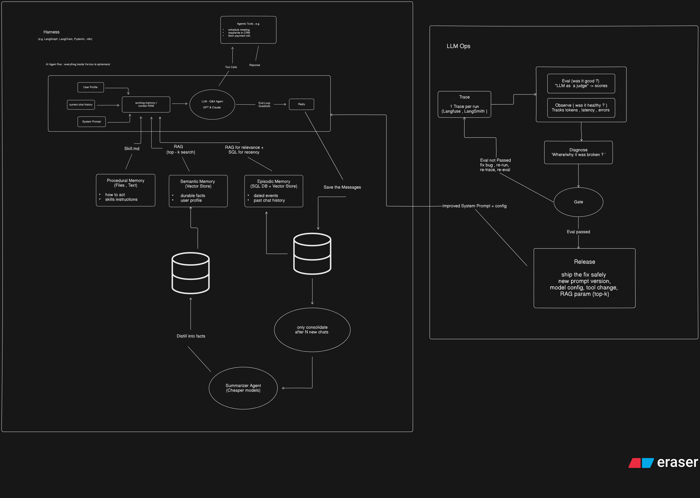

<!-- Dual-Theme Dynamic Gradient Header -->

<!-- High-Energy Typing Text -->

 

<!-- Premium Cyber Badges -->

  
  
  

 

### 🎯 Ｃｕｒｒｅｎｔ Ｓｐｏｔｌｉｇｈｔ

I am currently dedicating my engineering bandwidth to complex AI infrastructure and academic research:

1. **Architecting `agent-contracts`:** Building a next-generation, open-source specification for AI workflows. This framework establishes robust behavioral boundaries, gated releases, LLM-as-a-judge evals, and runtime observability for autonomous multi-agent systems.
2. **LLMOps & Cognitive Architectures:** Designing production-grade agents equipped with distinct procedural, semantic, and episodic memory pipelines (RAG & Vector integrations) backed by rigorous tracing (Langfuse/LangSmith).
3. **Research & Development Intern @ NIT Durgapur:** Driving advanced computational research at the intersection of theoretical algorithms and applied AI innovation. 

 

### 🧠 Ｃｏｇｎｉｔｉｖｅ Ａｒｃｈｉｔｅｃｔｕｒｅ

> **System Design: Multi-Agent Harness & LLMOps Pipeline** 
> Showcasing my architectural approach to structuring persistent memory (Semantic/Episodic/Procedural), top-k RAG pipelines, and gated release evaluations.

  

 

### 🌌 Ｔｈｅ Ｖｉｓｉｏｎ

> **Forging the bridge between autonomous cognitive systems and scalable full-stack ecosystems.** 
> I am an engineering undergrad driven by building high-impact, production-grade infrastructure. Whether I am architecting real-time forensic engines for deepfake detection, engineering secure cloud-edge ecosystems, or automating agentic pipelines with robust guardrails, I build to solve complex technical bottlenecks. When the IDE closes, I'm usually diving into a solid novel, grinding games, or keeping up with the latest anime.

 

### ⚡ Ｔｅｃｈｎｉｃａｌ Ａｒｓｅｎａｌ

**AI, ML & Agentic Workflows** 

**Full-Stack Web (MERN & Next.js)** 

**Core Architecture & Security** 

 
 

### 🔮 Ｓｉｇｎａｔｕｒｅ Ｐｒｏｊｅｃｔｓ

| ❖ | System | Mission Outline | Stack |
|---|:---|:---|:---|
| 🏗️ | **[agent-contracts](https://github.com/Skull-boy/agent-contracts)** | Open-source, framework-agnostic specification defining guardrails, evals, and runtime permissions for autonomous AI workflows. | `Python` `LangGraph` `n8n` |
| 🎓 | **[Styme (StudyBuddy.ai) v2.0](#)** | A modern, all-in-one study dashboard combining an intelligent Gemini AI Tutor, focus tools, and gamification into a beautiful interface. | `MERN` `Gemini` |
| 🚀 | **[Campus Hero (Campus_Nova)](#)** | Centralized ecosystem enabling 500+ students to discover campus clubs and access structured career guidance resources. | `Next.js` `Firebase` |
| 🛡️ | **Real-Time Forensic Engine** | Lead Researcher for a forensic engine that detects high-fidelity deepfakes to secure digital trust during live interviews. | `Deep Learning` `Python` |
| 🎨 | **[WallGodds](#)** | Open-source contributor focusing on core UI/UX enhancements and automating aspect-ratio sorting and tagging. | `Automation` `UI/UX` |

 
 

### 📊 Ｐｅｒｆｏｒｍａｎｃｅ Ｍｅｔｒｉｃｓ

 

  ⚡ If my frameworks or platforms bring value to your engineering journey, dropping a star on my repositories goes a long way. ⚡

